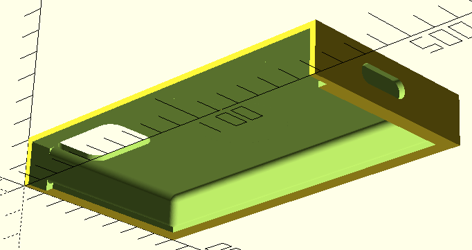

= iPhoneHolder

A simple iPhoneX holder to be installed in the car.
The iPhoneX I use has a QuadLock cover and the phone has to fit into the holder with the cover.

The design contains a module, which is the solid body of the iPhoneX itself inside the QuadLock cover.
This solid body has protruding parts at the screen, camera and the power adapter.

The holder is a solid box and the iPhoneX body is removed from it using `difference(){}`.

In addition to that the top of the holder is cut off, so that the phone can be put into it from the top.

I use the holder in my Prius glued to board in front of the steering wheel using Gekko Tape.

Here is the picture of the first three versions, which were too small and the phone did not fit.

image::IMG-6274.jpg[width=500px]

The last version may be a bit too big, but it works.
I also spray-painted it to black.

Files:

* link:iphoneX-in-quadlock.stl[Stl file compiled]
* link:iphoneX-in-quadlock.scad[OpenScad file]